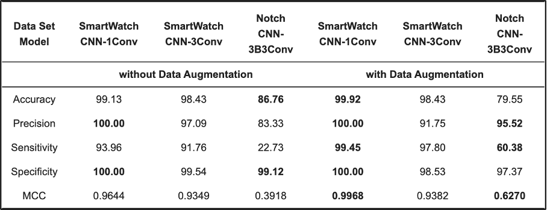
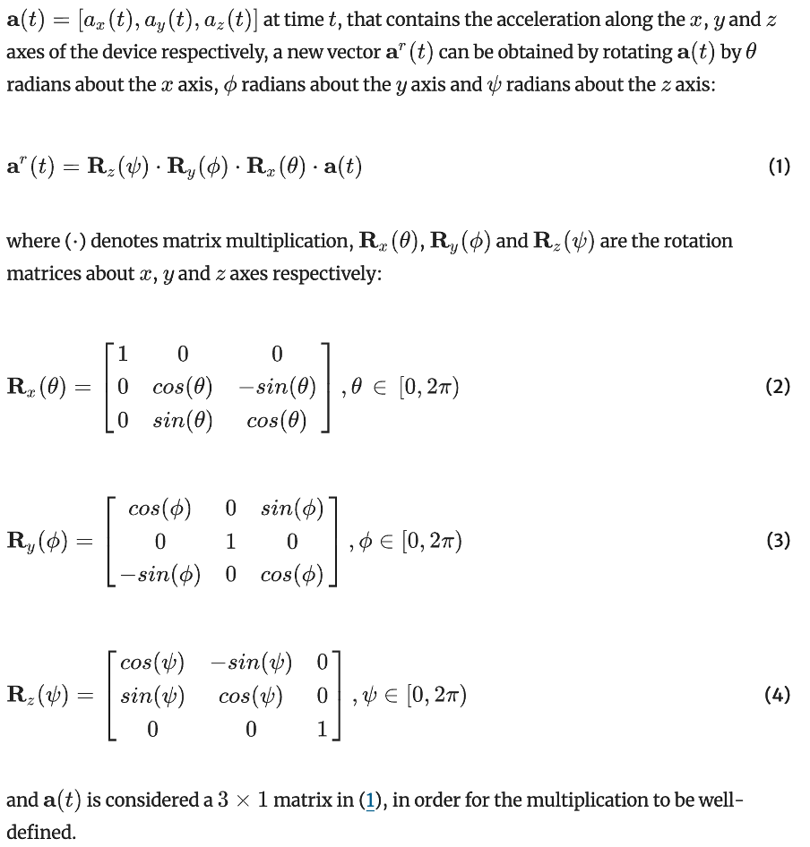
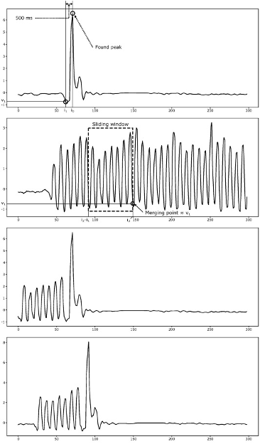
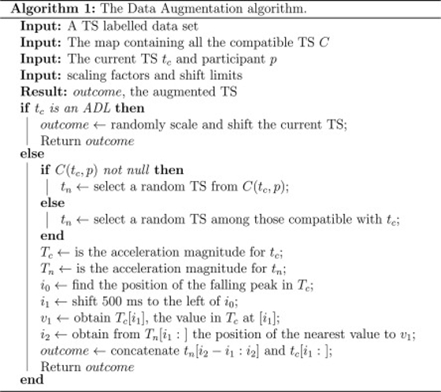

# [Accelerometer-Based Human Fall Detection Using Convolutional Neural Networks (2019)](https://www.mdpi.com/1424-8220/19/7/1644)

## Abstract
This paper looks at fall detection using a Convolutional Neural Network (CNN). The model has three convolutional layers, two max-pooling layers, and three fully connected layers. It was tested using three open datasets, and they also used data augmentation (DA) to improve results.

## Overview of Methodologies

### CNN
A CNN consist of layers that automatically and adaptively learn features from input images, making them highly effective for tasks such as image classification, object detection, and segmentation. The core components of CNNs include convolutional layers, which apply filters to detect features, pooling layers, which reduce dimensionality and computational complexity, and fully connected layers, which perform the final classification.

### LSTM
CNNs are great for handling multi-dimensional data, like images. But for time series data, Recurrent Neural Networks (RNNs) are used. RNNs have a memory function to learn from sequential data. However, they struggle with long sequences due to the vanishing gradient problem, so LSTMs were introduced. LSTMs have three gates (input, forget, and output) to control the information flow, helping solve the vanishing gradient issue

## Methodology
The paper evaluates the CNN model in two ways: comparing it with another model (LSTM-Acc Rot) from a previous paper and testing it across different datasets.

### Experiment 1
In this experiment, the CNN model (CNN-3B3Conv) was compared with the LSTM-Acc Rot model, which was trained on the URFB dataset using data augmentation to improve performance. The CNN model also used DA by applying random rotations to accelerometer data to create new samples. The results showed that the CNN model with DA outperformed the others, but the LSTM Acc Rot model performed almost as well.

| Metrics                        | CNN-3B3Conv without DA | CNN-3B3Conv with DA | LSTM Acc | LSTM Acc Rot |
|--------------------------------|------------------------|----------------------|----------|--------------|
| Accuracy                       | 85.71                  | 99.86                | 95.71    | 98.57        |
| Precision                      | 83.33                  | 100.00               | 95.00    | 100.00       |
| Sensitivity                    | 83.33                  | 99.72                | 96.67    | 96.67        |
| Specificity                    | 87.50                  | 100.00               | 95.00    | 100.00       |

### Experiment 2
This experiment evaluated the model using two different datasets, with and without DA. The results showed that using DA improved performance. Also, a simpler CNN architecture performed better than a more complex one, as more complex models tend to overfit.

## Conclusion
The paper helps in deciding the starting point for fall detection and activity monitoring. It suggests testing models with and without DA, creating CNN, LSTM, and GRU models, and considering both accelerometer and gyroscope data for better results. The final model will be selected based on factors like time taken, overall performance, model complexity, and explainability.

---

# [Human Fall Detection from Acceleration Measurements using a RNN (2017)](https://link.springer.com/chapter/10.1007/978-981-10-7419-6_25#Abs1)

## Abstract
This paper presents a method for fall detection using Recurrent Neural Networks (RNNs). The study also explores how data augmentation through random 3D rotations can improve model performance.

### Proposed Data Augmentation
The paper evaluates the effectiveness of adding more training data through random rotations to improve model generalization and performance.

## Conclusions
The proposed RNN-based method was able to detect all but one fall event, with no false alarms, when tested on the URFD dataset.

---

# [Towards Effective Detection of Elderly Falls with CNN-LSTM Neural Networks](https://www.sciencedirect.com/science/article/pii/S0925231222006440#ab005)

## Summary
This paper still uses an LSTM model but introduces a new data augmentation technique. The technique involves matching a fall event with a similar activity of daily living (ADL) before the fall. This makes the data reflect real-world falls more accurately, as the datasets usually contain staged falls. The study also uses a 3-second window with a 1-second stride for better accuracy. 

The technique involves picking a similar daily activity (ADL) for each fall type. During a fall, they find the peak moment, move 500ms backward, and mark that spot. Then, they look for a matching section in the ADL and insert it before the marked point. This helps make the data reflect real-world falls more accurately since most available datasets only have staged falls and don’t capture the random activities that usually happen before a fall in real life.

The following figures give an overview of the technique:

